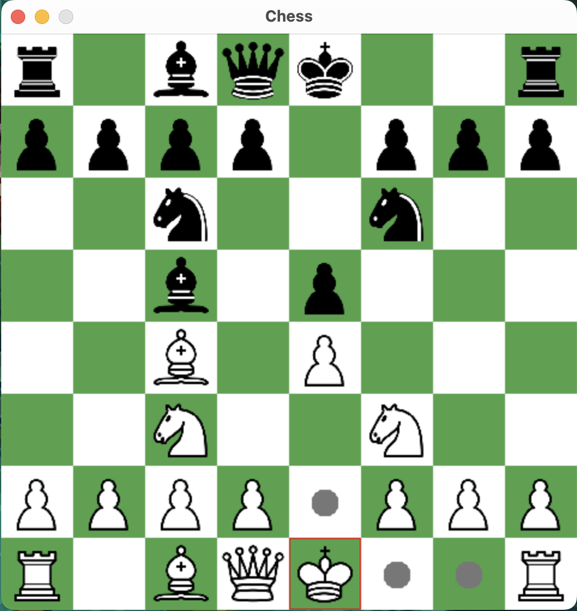

# How to Execute this Program
1. Ensure that you have SDL2/SDL_image.h and SDL2 ready.
2. In the directory, execute `cmake .`
3. Once the build files have been compiled, execute `make`.
4. `./chess` to start the game.

Note: This version of chess supports all valid chess rules.

